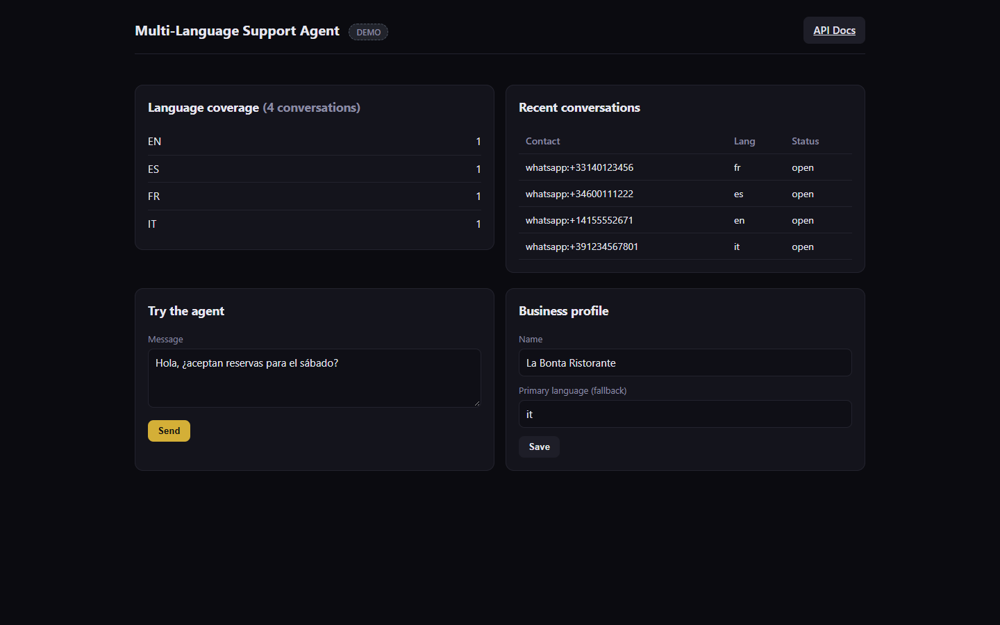
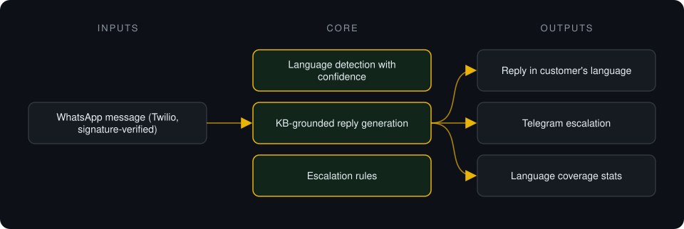
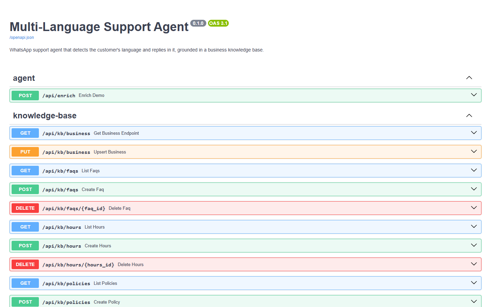

# Multi-Language Support Agent

**WhatsApp support agent that detects the customer's language and answers fluently in it, grounded only in the business's own knowledge base.**

> **This is a proprietary project. Source code is private. This page showcases the system's architecture and results.**

**Case study page:** [https://jryahia.github.io/showcase-multi-language-support-agent/](https://jryahia.github.io/showcase-multi-language-support-agent/)

## Problem it solves

Support teams cannot staff every language customers write in. This agent detects the language, answers from the business's FAQ, hours and policies, escalates what it should not handle, and shows which languages customers actually use.

## Architecture

1. A signed WhatsApp message arrives via Twilio.
2. The language is detected with a confidence score; low confidence falls back to the primary language.
3. A reply is generated only from the knowledge base, in the detected language.
4. Sensitive cases escalate to a human via Telegram; language usage is recorded.

## Key features

- Language detection across 75+ languages
- Answers restricted to the configured knowledge base
- Confidence-based fallback
- Real Telegram escalation, logged
- Language coverage dashboard

## Tech stack

     

## What it does in practice

- Shows the business which languages its inbound volume actually arrives in.

## Screenshots

**Language coverage and live test box**

**API surface: agent, knowledge base, stats**

---

Built by [Yahya Jarray](https://github.com/jryahia). Interested in a similar system? [Get in touch](mailto:yahiajarray43@gmail.com).
